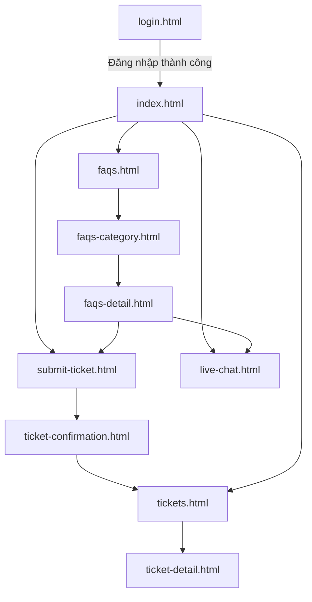
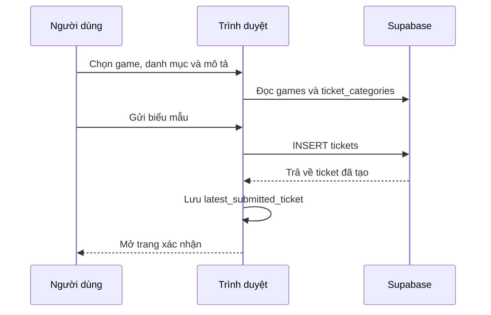
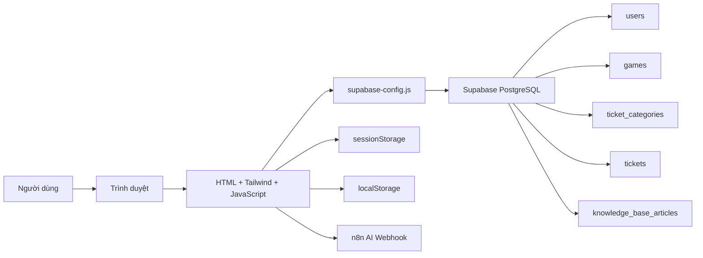
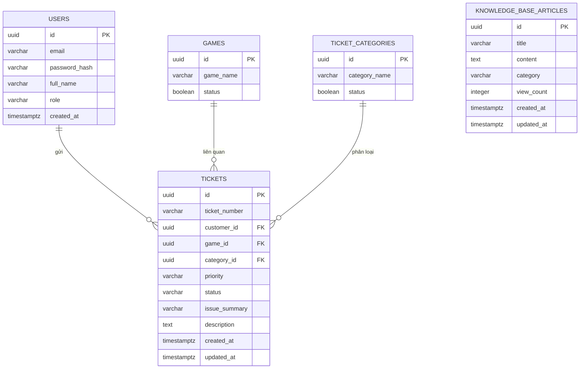

# Game Support Customer Portal

Game Support Customer Portal là cổng hỗ trợ khách hàng dành cho người chơi game. Hệ thống tập trung các hoạt động tự phục vụ và hỗ trợ sau bán hàng vào một giao diện thống nhất: tra cứu bài viết hướng dẫn, gửi yêu cầu hỗ trợ, theo dõi ticket và trò chuyện với trợ lý AI.

Ứng dụng được xây dựng dưới dạng website tĩnh bằng HTML, Tailwind CSS và JavaScript thuần. Không có bước build frontend; mỗi trang tự chứa giao diện và phần lớn logic nghiệp vụ, sau đó kết nối trực tiếp đến Supabase và webhook n8n từ trình duyệt.

## Mục lục

- [Tính năng chính](#tính-năng-chính)
- [Luồng sử dụng](#luồng-sử-dụng)
- [Công nghệ sử dụng](#công-nghệ-sử-dụng)
- [Kiến trúc hệ thống](#kiến-trúc-hệ-thống)
- [Cấu trúc dự án](#cấu-trúc-dự-án)
- [Mô tả các trang](#mô-tả-các-trang)
- [Hướng dẫn chạy dự án](#hướng-dẫn-chạy-dự-án)
- [Cấu hình Supabase](#cấu-hình-supabase)
- [Mô hình dữ liệu](#mô-hình-dữ-liệu)
- [Cơ chế xác thực](#cơ-chế-xác-thực)
- [Tích hợp trợ lý AI](#tích-hợp-trợ-lý-ai)
- [Quy ước dữ liệu và điều hướng](#quy-ước-dữ-liệu-và-điều-hướng)
- [Lưu ý bảo mật và triển khai](#lưu-ý-bảo-mật-và-triển-khai)
- [Phạm vi hiện tại](#phạm-vi-hiện-tại)

## Tính năng chính

### 1. Trang chủ hỗ trợ

Trang `index.html` là màn hình chính sau khi đăng nhập:

- Hiển thị lời chào theo tên người dùng trong phiên hiện tại.
- Cung cấp lối tắt đến FAQ, tạo ticket, danh sách ticket và trợ lý AI.
- Thống kê số ticket theo ba nhóm: `Open`, `In Progress` và `Resolved`.
- Truy vấn các bài viết phổ biến từ `knowledge_base_articles`, sắp xếp theo `view_count`.
- Dùng dữ liệu mẫu dự phòng nếu Supabase chưa sẵn sàng hoặc truy vấn thất bại.

### 2. Trung tâm FAQ

Ba trang tạo thành luồng tra cứu kiến thức:

- `faqs.html`: danh mục FAQ và tìm kiếm bài viết.
- `faqs-category.html`: danh sách bài viết thuộc một chủ đề.
- `faqs-detail.html`: nội dung chi tiết của một bài viết.

Chức năng gồm:

- Tìm kiếm theo tiêu đề và nội dung bài viết trên Supabase.
- Hiển thị 6 danh mục chính và mở rộng lên 12 danh mục.
- Đếm số bài viết theo từng danh mục.
- Điều hướng theo tham số URL như `?category=technical` hoặc `?id=<article_id>`.
- Tăng `view_count` khi người dùng mở bài viết.
- Hiển thị nội dung tĩnh dự phòng khi không có ID bài viết từ cơ sở dữ liệu.
- Widget đánh giá “Was this article helpful?” hiện chỉ phản hồi trên giao diện, chưa lưu vào database.

Các chủ đề giao diện hiện hỗ trợ gồm Technical Issues, Account & Security, Billing & Purchases, Gameplay & Mechanics, Community & Social, Competitive Play, Game Downloads, Esports, Merchandise Support, Creator Program, Localization và Feedback.

### 3. Tạo ticket hỗ trợ

Trang `submit-ticket.html` cho phép:

- Tải danh sách game đang hoạt động từ bảng `games`.
- Tải danh mục hỗ trợ đang hoạt động từ bảng `ticket_categories`.
- Sinh thêm câu hỏi theo danh mục người dùng chọn.
- Kiểm tra các trường bắt buộc trước khi bật nút gửi.
- Tạo mã ticket theo mẫu `TCK-YYYYMMDD-XXXXX`.
- Ghi ticket mới vào bảng `tickets` với mức ưu tiên mặc định `MEDIUM` và trạng thái `OPEN`.
- Ghép câu trả lời bổ sung vào trường `description` dưới phần đánh dấu `-- Category Details --`.
- Lưu ticket vừa tạo vào `localStorage` để trang xác nhận có thể hiển thị ngay.

Biểu mẫu động hiện có cấu hình riêng cho các nhóm như Technical Issues, Connection & Network, Account & Security, Billing & Purchases, Bug Report và Report a Player.

### 4. Xác nhận ticket

Trang `ticket-confirmation.html`:

- Đọc dữ liệu từ khóa `latest_submitted_ticket` trong `localStorage`.
- Hiển thị mã ticket và thời gian dự kiến nhận phản hồi.
- Cho phép quay lại trang chủ hoặc mở danh sách ticket.

Trang này không tự tạo ticket mới; việc ghi database đã hoàn tất ở `submit-ticket.html`.

### 5. Theo dõi ticket

Trang `tickets.html`:

- Chỉ tải ticket có `customer_id` trùng với người dùng hiện tại.
- Join quan hệ đến `games` và `ticket_categories`.
- Hiển thị mã ticket, game, danh mục, ngày tạo và trạng thái.
- Lọc nhanh theo `All`, `Open`, `In Progress` và `Resolved`.
- Chuẩn hóa một số trạng thái như `drafting` và `in_progress` về nhóm `In Progress`.
- Mở trang chi tiết bằng URL `ticket-detail.html?id=<ticket_id>`.

Trang `ticket-detail.html`:

- Hiển thị mã ticket, trạng thái, ngày tạo, game và danh mục.
- Hiển thị banner tiến độ khác nhau theo trạng thái.
- Tách nội dung mô tả chính và các câu trả lời động đã ghép trong `description`.
- Hiện tại chủ yếu là chế độ đọc; chưa có chức năng khách hàng trả lời ticket hoặc tải tệp đính kèm.

### 6. Trợ lý AI

Trang `live-chat.html` cung cấp giao diện chat với **ALPHi - AI Support Agent**:

- Tạo và lưu `chat_session_id` trong `sessionStorage`.
- Gửi nội dung người dùng và mã phiên đến webhook n8n.
- Hiển thị trạng thái đang trả lời.
- Hỗ trợ phản hồi JSON, văn bản thường và NDJSON dạng streaming.
- Tự cuộn đến tin nhắn mới nhất.
- Hiển thị thông báo riêng cho lỗi webhook chưa kích hoạt, CORS hoặc lỗi kết nối.

Tên file là `live-chat.html`, nhưng triển khai hiện tại là chatbot AI qua n8n, không phải kênh chat trực tiếp với nhân viên và không dùng Supabase Realtime.

## Luồng sử dụng



Luồng ticket:



## Công nghệ sử dụng

| Thành phần | Công nghệ |
|---|---|
| Giao diện | HTML5 |
| Thiết kế | Tailwind CSS qua CDN, CSS nội tuyến theo từng trang |
| Ngôn ngữ | Vanilla JavaScript ES6+ |
| Font | Google Fonts: Inter |
| Biểu tượng | Material Symbols Outlined |
| Backend as a Service | Supabase |
| Cơ sở dữ liệu | Supabase PostgreSQL |
| SDK dữ liệu | `@supabase/supabase-js` phiên bản 2 qua CDN |
| Kiểm tra mật khẩu | `bcryptjs` |
| Trợ lý AI | n8n webhook |
| Quản lý phiên | `sessionStorage` |
| Dữ liệu chuyển trang tạm thời | `localStorage` |

`package.json` chỉ khai báo `bcryptjs`. Dự án không có script build, framework frontend, bundler hoặc test runner.

## Kiến trúc hệ thống



Mỗi trang HTML là một màn hình độc lập. Giao diện, dữ liệu mẫu dự phòng, xử lý sự kiện và truy vấn Supabase phần lớn nằm trực tiếp trong thẻ `<script>` của trang đó.

Tệp dùng chung `supabase-config.js` chịu trách nhiệm:

- Khởi tạo Supabase client.
- Đọc người dùng từ `sessionStorage`.
- Cung cấp người dùng mock khi chưa có phiên.
- Cung cấp `checkAuth()`, `logout()` và `getSupabase()`.
- Đồng bộ tên người dùng lên một số phần tử header.

## Cấu trúc dự án

```text
customer_view/
├── README.md
├── index.html
├── login.html
├── faqs.html
├── faqs-category.html
├── faqs-detail.html
├── submit-ticket.html
├── ticket-confirmation.html
├── tickets.html
├── ticket-detail.html
├── live-chat.html
├── supabase-config.js
├── package.json
├── package-lock.json
└── .gitignore
```

## Mô tả các trang

| Tệp | Vai trò |
|---|---|
| `login.html` | Đăng nhập bằng email và mật khẩu |
| `index.html` | Trang chủ, lối tắt hỗ trợ, thống kê ticket và bài viết phổ biến |
| `faqs.html` | Trung tâm FAQ, tìm kiếm và danh mục kiến thức |
| `faqs-category.html` | Danh sách bài viết theo danh mục |
| `faqs-detail.html` | Nội dung bài viết và tăng lượt xem |
| `submit-ticket.html` | Biểu mẫu động và tạo ticket |
| `ticket-confirmation.html` | Xác nhận ticket vừa gửi |
| `tickets.html` | Danh sách và bộ lọc ticket của khách hàng |
| `ticket-detail.html` | Chi tiết và tiến độ của một ticket |
| `live-chat.html` | Giao diện trợ lý AI kết nối webhook n8n |
| `supabase-config.js` | Cấu hình Supabase, session helper và người dùng mặc định |

## Hướng dẫn chạy dự án

### Yêu cầu

- Trình duyệt hiện đại.
- Kết nối Internet để tải Tailwind CSS, Supabase SDK, Google Fonts, Material Symbols và gọi n8n.
- Python, Node.js hoặc một HTTP server tĩnh tương đương.
- Dự án Supabase có schema và chính sách truy cập phù hợp.

### Cài dependency

Dependency npm chỉ cần thiết nếu muốn quản lý hoặc sử dụng bản cục bộ của `bcryptjs`:

```powershell
npm install
```

Giao diện hiện vẫn tải bcrypt từ CDN, vì vậy website không cần bước build sau khi cài.

### Chạy bằng Python

```powershell
py -m http.server 8080
```

Sau đó mở:

```text
http://localhost:8080/login.html
```

Hoặc dùng Node.js:

```powershell
npx serve .
```

Không nên mở trực tiếp bằng `file://`, vì request đến CDN, Supabase hoặc n8n có thể gặp hạn chế về origin và CORS.

### Tài khoản thử nghiệm

Mã nguồn có cơ chế đăng nhập nhanh:

```text
Email:    customer@gmail.com
Password: customer
```

Ngoài tài khoản này, trang đăng nhập truy vấn bảng `users` theo email rồi dùng `bcrypt.compareSync()` để so sánh mật khẩu với `password_hash`.

## Cấu hình Supabase

Thông tin kết nối nằm trong `supabase-config.js`:

```javascript
const SUPABASE_URL = "https://<project-ref>.supabase.co";
const SUPABASE_ANON_KEY = "<anon-key>";
```

Các API dùng chung:

```javascript
getSupabase();
getCurrentUser();
checkAuth();
logout();
```

Anon key được phép xuất hiện ở frontend, nhưng chỉ an toàn khi Row Level Security được bật và policy được cấu hình đúng. Tuyệt đối không đưa `service_role` key vào repository hoặc mã chạy trên trình duyệt.

## Mô hình dữ liệu

Repository không chứa migration SQL. Schema dưới đây được tổng hợp từ các truy vấn, payload và quan hệ đang dùng trong frontend.



### `users`

Tài khoản và hồ sơ đăng nhập:

- `id`: UUID của người dùng.
- `email`: email đăng nhập, nên có ràng buộc duy nhất.
- `password_hash`: mật khẩu đã băm bằng bcrypt.
- `full_name`: tên hiển thị.
- `role`: vai trò, giao diện hiện sử dụng `CUSTOMER`.
- `created_at`: thời điểm tạo.

### `games`

Danh sách game trong biểu mẫu ticket:

- `id`.
- `game_name`.
- `status`: chỉ bản ghi `true` được tải vào biểu mẫu.

### `ticket_categories`

Danh mục phân loại ticket:

- `id`.
- `category_name`.
- `status`: chỉ bản ghi `true` được hiển thị.

Tên danh mục trong database cần khớp với cấu hình `categoryFields` ở `submit-ticket.html` nếu muốn hiện đúng bộ câu hỏi động.

### `tickets`

Yêu cầu hỗ trợ của khách hàng:

- `id`.
- `ticket_number`: mã tham chiếu hiển thị cho người dùng.
- `customer_id`: liên kết `users.id`.
- `game_id`: liên kết `games.id`.
- `category_id`: liên kết `ticket_categories.id`.
- `priority`: frontend tạo mới với `MEDIUM`.
- `status`: frontend tạo mới với `OPEN`.
- `issue_summary`: mô tả ngắn được tạo từ nội dung người dùng.
- `description`: mô tả đầy đủ và câu trả lời bổ sung.
- `created_at`, `updated_at`.

Các giá trị trạng thái mà giao diện nhận biết gồm `OPEN`, `IN_PROGRESS`, `DRAFTING`, `RESOLVED` và `CLOSED`.

### `knowledge_base_articles`

Kho bài viết FAQ:

- `id`.
- `title`.
- `content`.
- `category`.
- `view_count`.
- `created_at`, `updated_at`.

`content` được đưa vào vùng hiển thị HTML sau khi thay thế một số ký tự xuống dòng. Vì vậy dữ liệu bài viết phải đến từ nguồn quản trị đáng tin cậy và cần được làm sạch nếu cho phép người dùng không tin cậy nhập nội dung.

## Cơ chế xác thực

Hệ thống hiện không dùng Supabase Auth. Luồng đăng nhập là:

1. Người dùng nhập email và mật khẩu tại `login.html`.
2. Frontend truy vấn trực tiếp bảng `users` theo email.
3. Frontend nhận `password_hash` và so sánh bằng `bcryptjs`.
4. Hồ sơ người dùng được lưu vào `sessionStorage` với khóa `support_portal_user`.
5. Các trang đọc lại đối tượng này bằng `getCurrentUser()`.

Ngoài ra:

- Tài khoản `customer@gmail.com` / `customer` được bypass trực tiếp.
- `getCurrentUser()` trả về người dùng mock nếu không tìm thấy session.
- `index.html` chủ động ghi user mock vào session khi tải trang.

Do đó cơ chế hiện tại phù hợp cho demo học tập, không phải xác thực production. `checkAuth()` gần như không thể chặn truy cập khi fallback user luôn tồn tại.

## Tích hợp trợ lý AI

`live-chat.html` gửi request `POST` đến webhook n8n với payload:

```json
{
  "action": "sendMessage",
  "sessionId": "<browser-session-id>",
  "chatInput": "<user-message>"
}
```

Workflow n8n cần:

- Có endpoint production đúng với URL cấu hình trong trang.
- Được bật trước khi sử dụng.
- Trả về JSON, text hoặc NDJSON mà frontend có thể phân tích.
- Cho phép origin của website qua CORS.
- Duy trì bộ nhớ hội thoại theo `sessionId` nếu cần hội thoại nhiều lượt.

Webhook đang được đặt trực tiếp trong mã frontend. Khi đổi môi trường, cần cập nhật URL tại `live-chat.html`.

## Quy ước dữ liệu và điều hướng

### Tham số URL

| Trang | Tham số |
|---|---|
| `faqs-category.html` | `category`, ví dụ `?category=technical` |
| `faqs-detail.html` | `id=<article_id>` cho dữ liệu Supabase |
| `faqs-detail.html` | `category` và `article` cho dữ liệu tĩnh dự phòng |
| `ticket-detail.html` | `id=<ticket_id>` |

### Browser storage

| Khóa | Loại | Mục đích |
|---|---|---|
| `support_portal_user` | `sessionStorage` | Hồ sơ người dùng hiện tại |
| `chat_session_id` | `sessionStorage` | Mã phiên hội thoại n8n |
| `latest_submitted_ticket` | `localStorage` | Dữ liệu ticket dùng cho trang xác nhận |

### Dữ liệu dự phòng

Nhiều trang chứa danh mục và bài viết mẫu trực tiếp trong JavaScript. Cách này giúp giao diện vẫn có nội dung khi database chưa sẵn sàng, nhưng có thể tạo khác biệt giữa nội dung tĩnh và nội dung Supabase. Khi triển khai chính thức nên chọn một nguồn dữ liệu chuẩn.

## Lưu ý bảo mật và triển khai

- Cơ chế đăng nhập hiện truy vấn `password_hash` về trình duyệt. Đây không phải mô hình phù hợp cho production; nên chuyển sang Supabase Auth hoặc API xác thực phía server.
- Không dựa vào `sessionStorage`, user mock hoặc ẩn nút trên giao diện để kiểm soát quyền truy cập.
- Bật RLS cho toàn bộ bảng và giới hạn khách hàng chỉ được đọc ticket có `customer_id` của chính họ.
- Không cho phép client tự gán tùy ý `customer_id`, `priority` hoặc trạng thái nhạy cảm nếu không có policy kiểm soát.
- Giới hạn quyền cập nhật `view_count`; cách đọc rồi ghi `view_count + 1` hiện có thể mất lượt xem khi nhiều request chạy đồng thời.
- Làm sạch nội dung HTML của FAQ trước khi render để tránh XSS.
- Không commit service key, token quản trị, mật khẩu hoặc credential n8n.
- Bảo vệ webhook n8n bằng xác thực, rate limiting, kiểm tra input và CORS phù hợp.
- CDN là phụ thuộc runtime; website cần Internet để tải giao diện và SDK.
- Repository chưa có migration, seed script độc lập, test tự động, lint hoặc pipeline CI.
- Các đoạn logic điều hướng và dữ liệu mẫu đang lặp lại trong nhiều file HTML; thay đổi chung phải được đồng bộ trên tất cả các trang.

## Phạm vi hiện tại

Đây là dự án cổng hỗ trợ khách hàng phục vụ mục đích học tập, trình diễn quy trình quản lý ticket và tích hợp AI. Phiên bản hiện tại đã thể hiện đầy đủ luồng người dùng cơ bản nhưng chưa phải hệ thống chăm sóc khách hàng production.

Để triển khai thực tế, nên bổ sung:

- Supabase Auth hoặc backend xác thực riêng.
- Migration và seed dữ liệu có quản lý phiên bản.
- RLS và phân quyền cho khách hàng, nhân viên hỗ trợ và quản trị viên.
- Luồng nhân viên phản hồi ticket, lịch sử trao đổi và tệp đính kèm.
- Thông báo email hoặc thông báo trong ứng dụng.
- Lưu đánh giá FAQ vào database.
- Chat realtime với nhân viên nếu đó là yêu cầu nghiệp vụ.
- Quản lý biến môi trường thay cho URL và khóa viết trực tiếp trong mã.
- Kiểm thử tự động, logging, giám sát lỗi và CI/CD.
