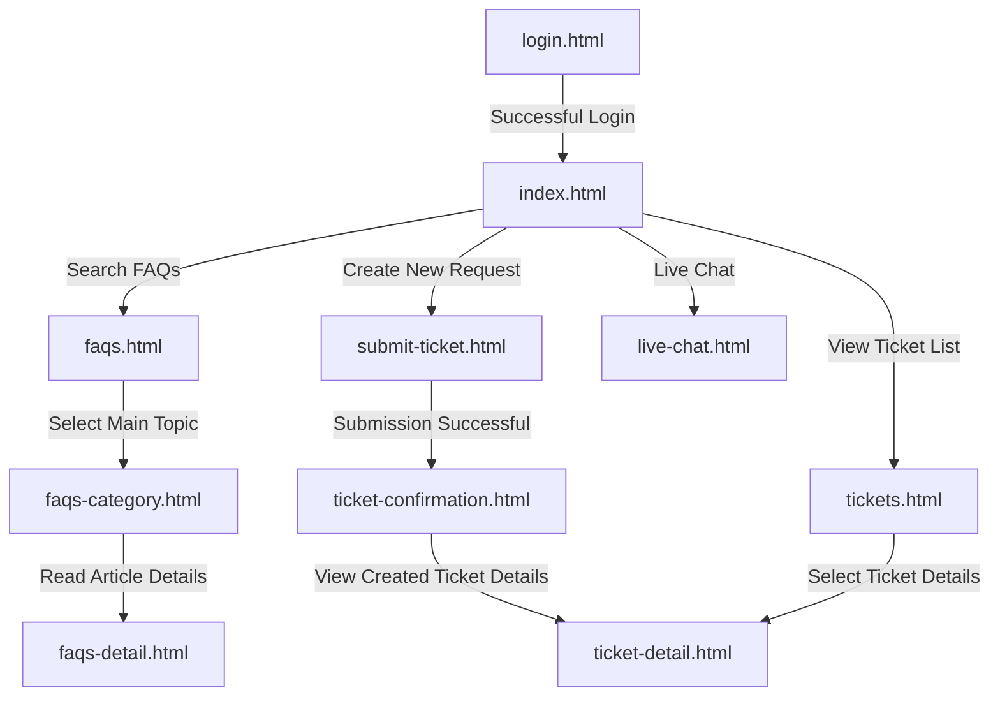

# Game Support Customer Portal

This is a detailed document describing the pages, user workflows, database structure, and operational guidelines of the **Customer Support Website (Customer Portal)** designed for game publishers. The system features an optimized layout and a modern user interface (dark-mode theme/Tailwind CSS) to help players easily search for solutions or interact directly with support agents to resolve issues.

---

## 📌 System Overview

The system is built on a minimalist design philosophy, focusing on the customer experience (User Experience):
1. **Direct Account Authentication:** Players use their game accounts to log in and securely manage their support requests.
2. **Frequently Asked Questions (FAQs):** Provides articles categorized into 12 main topics to reduce the volume of support tickets requiring manual handling.
3. **Automated Support Ticket System:** Players submit personalized support requests. The system dynamically renders appropriate input fields based on the selected issue category.
4. **Live Chat Support:** A real-time interaction channel that quickly connects players with support agents.

---

## 🗺️ User Flow Diagram



---

## 📄 Page Descriptions

The system consists of 10 premium HTML pages:

### 1. [login.html] - Login Page
*   **Function:** The primary entry point of the system. Authenticates users via their registered email.
*   **UI/UX & Code Highlights:**
    *   Secure login form featuring a password visibility toggle (show/hide).
    *   A prominent red alert box to display login error messages.
    *   **Login Bypass** mechanism for developers/testers: automatically logs in when using the mock account `customer@gmail.com` with password `customer` without requiring network connectivity.
    *   Client-side password hashing integration using the `bcryptjs` library.

### 2. [index.html] - Support Portal Home Page
*   **Function:** The main dashboard displayed post-authentication.
*   **UI/UX & Code Highlights:**
    *   Personalized welcome banner displaying the player's name dynamically (`Hello {User Name}`).
    *   Real-time **Ticket Status Statistics** (Open, In Progress, Resolved) fetched directly from Supabase.
    *   **Popular Articles** section automatically ranked based on page views from the database.
    *   A sticky header navigation bar that is fully responsive across all devices.

### 3. [faqs.html] - FAQs Hub
*   **Function:** A centralized repository of articles addressing common issues.
*   **UI/UX & Code Highlights:**
    *   Smart search bar: Instant full-text search query across article titles (`title`) and descriptions/contents (`content`) utilizing the Supabase Client API.
    *   Support Category Grid: Displays the 6 most popular topics by default. Clicking "View all 12 categories" triggers a smooth transition that inserts 6 additional subcategories (Game Downloads, Esports, Merch, Creator Program, Localization, Feedback).
    *   Dynamic article count indicators on each category badge.

### 4. [faqs-category.html] - Category-Specific Article List
*   **Function:** Lists all articles belonging to a specific selected category.
*   **UI/UX & Code Highlights:**
    *   Parses query parameters from the URL (`?category=technical`, ...) to automatically fetch corresponding articles.
    *   Displays article cards with custom hover effects (border color change), estimated reading time, and last updated date.
    *   Hierarchical breadcrumb navigation for easy navigation.

### 5. [faqs-detail.html] - FAQ Article Detail Page
*   **Function:** Displays step-by-step instructions for troubleshooting specific issues.
*   **UI/UX & Code Highlights:**
    *   Clean typographic layout featuring driver specification tables and highlighted warning callouts.
    *   Interactive feedback widget: `"Was this article helpful?"` with Yes/No choices, which changes to a thank-you note once clicked.
    *   Call-to-Action (CTA) section at the bottom of the page encouraging users to submit a ticket or start a live chat if the article does not resolve their issue.

### 6. [submit-ticket.html] - Submit Support Ticket
*   **Function:** Form to create a new support ticket and send it to the technical support team.
*   **UI/UX & Code Highlights:**
    *   **Dynamic Form fields:** Automatically renders additional specific fields based on the selected issue category. For example:
        *   *Technical Issues:* Operating System, Error Type, System Specifications, Error Code.
        *   *Billing & Purchases:* Billing Issue Category, Payment Method, Invoice Number.
        *   *Report a Player:* Report Reason, Offending Player's Name, Match Timestamp.
    *   **Form Validation:** The "SUBMIT TICKET" button remains disabled and is only enabled once all required inputs are filled and a description is provided.
    *   Secure data storage directly into the `tickets` table on Supabase.

### 7. [ticket-confirmation.html] - Ticket Submission Confirmation
*   **Function:** An intermediary page confirming the successful creation and storage of the ticket.
*   **UI/UX & Code Highlights:**
    *   Displays a randomly generated unique Ticket ID format: `TCK-YYYYMMDD-XXXXX`.
    *   Provides estimated response time expectations from the customer support team.

### 8. [tickets.html] - My Tickets List
*   **Function:** Manage and monitor support requests submitted by the user.
*   **UI/UX & Code Highlights:**
    *   Filter tab system: All, Open, In Progress, Resolved.
    *   Automatically joins database tables `games` and `ticket_categories` to display friendly game names and category names instead of raw UUID strings.
    *   Color-coded status badges (Red: Open, Orange: In Progress, Green: Resolved).

### 9. [ticket-detail.html] - Ticket Detail View
*   **Function:** Review the full detail and resolution progress of a specific support ticket.
*   **UI/UX & Code Highlights:**
    *   Two-column structural layout: The left column shows the main description/replies, and the right column contains metadata (Game, Category, Priority).
    *   Progress Banner notifying the user of the ticket's current stage with technical support agents.

### 10. [live-chat.html] - Live Chat Support
*   **Function:** Real-time chat interface to chat directly with support agents.
*   **UI/UX & Code Highlights:**
    *   Displays an estimated queue wait time dynamically.
    *   Visual distinction between user-sent messages (highlighted in blue on the right) and agent replies (gray on the left).
    *   Auto-scroll feature to automatically keep the chat window scrolled to the latest message.

---

## 💾 Supabase Database Schema

To support dynamic features, the Supabase database is structured as follows:

### 1. `users` Table (User Account Management)
*   **Purpose:** Stores user authentication and profile details.
*   **Fields:**
    *   `id` (UUID, Primary Key, Default: `gen_random_uuid()`): Unique identifier.
    *   `email` (VARCHAR, Unique, Not Null): Registered email used for logging in.
    *   `password_hash` (VARCHAR, Not Null): Hashed user password.
    *   `full_name` (VARCHAR): Display name.
    *   `role` (VARCHAR, Default: `'CUSTOMER'`): Access level (`CUSTOMER`, `AGENT`, `ADMIN`).
    *   `created_at` (TIMESTAMP): Account creation timestamp.

### 2. `games` Table (Supported Games List)
*   **Purpose:** Feeds the game selection dropdown during ticket creation.
*   **Fields:**
    *   `id` (UUID, Primary Key, Default: `gen_random_uuid()`): Unique game ID.
    *   `game_name` (VARCHAR, Not Null): Game title (e.g., *Valorant*, *League of Legends*).
    *   `status` (BOOLEAN, Default: `true`): Active status.

### 3. `ticket_categories` Table (Issue Categories)
*   **Purpose:** Categorizes issues for routing to the correct support team.
*   **Fields:**
    *   `id` (UUID, Primary Key, Default: `gen_random_uuid()`): Category ID.
    *   `category_name` (VARCHAR, Not Null): Category name (e.g., *Technical Issues*, *Billing & Purchases*).
    *   `status` (BOOLEAN, Default: `true`): Active status.

### 4. `tickets` Table (Customer Support Requests)
*   **Purpose:** Stores all support ticket information submitted by customers.
*   **Fields:**
    *   `id` (UUID, Primary Key, Default: `gen_random_uuid()`): Ticket ID.
    *   `ticket_number` (VARCHAR, Unique, Not Null): User-facing reference number (e.g., `TCK-20260611-89302`).
    *   `customer_id` (UUID, Foreign Key -> `users.id`): Creator of the ticket.
    *   `game_id` (UUID, Foreign Key -> `games.id`): Associated game.
    *   `category_id` (UUID, Foreign Key -> `ticket_categories.id`): Selected category.
    *   `priority` (VARCHAR, Default: `'MEDIUM'`): Priority level (`LOW`, `MEDIUM`, `HIGH`).
    *   `status` (VARCHAR, Default: `'OPEN'`): Progress status (`OPEN`, `IN_PROGRESS`, `RESOLVED`, `CLOSED`).
    *   `issue_summary` (VARCHAR, Not Null): Brief summary of the problem.
    *   `description` (TEXT, Not Null): Detailed explanation of the issue, including dynamic metadata fields.
    *   `created_at` (TIMESTAMP): Submission time.
    *   `updated_at` (TIMESTAMP): Last modification time.

### 5. `knowledge_base_articles` Table (FAQ & Guide Library)
*   **Purpose:** Houses all help articles and self-help troubleshooting guides.
*   **Fields:**
    *   `id` (UUID, Primary Key, Default: `gen_random_uuid()`): Article ID.
    *   `title` (VARCHAR, Not Null): Article title.
    *   `content` (TEXT, Not Null): Comprehensive article content.
    *   `category` (VARCHAR, Not Null): Theme classification (e.g., `'Technical Issues'`, `'Account & Security'`).
    *   `view_count` (INTEGER, Default: `0`): View statistics.
    *   `created_at` (TIMESTAMP): Date posted.
    *   `updated_at` (TIMESTAMP): Last updated date.

---

## 🛠️ Technology Stack

*   **HTML5 & CSS3:** Semantic and SEO-friendly structural layouts, fully responsive across both Mobile and Desktop viewports.
*   **Tailwind CSS (V3 CDN):** Provides a rapid utility-first styling workflow, customized HSL color systems, and modern box-shadow configurations mimicking premium modern designs (e.g., Riot Games aesthetics).
*   **Supabase Client SDK (`@supabase/supabase-js`):** Integrates real-time PostgreSQL database operations directly from the browser for data retrieval and submission.
*   **Bcryptjs Library:** Checks hashed passwords on the client side before submission to prevent raw password leakage over the network.
*   **Material Symbols Outlined & Google Fonts (Inter):** Standardized, clean icons and clean, modern typography.

---

## 🚀 Setup & Local Execution

### 1. Initialize Supabase Database Tables
Open the **SQL Editor** in your Supabase project dashboard and execute the following SQL script to create the necessary tables and populate mock data:

```sql
-- 1. Create users table
CREATE TABLE users (
    id UUID PRIMARY KEY DEFAULT gen_random_uuid(),
    email VARCHAR UNIQUE NOT NULL,
    password_hash VARCHAR NOT NULL,
    full_name VARCHAR,
    role VARCHAR DEFAULT 'CUSTOMER',
    created_at TIMESTAMP WITH TIME ZONE DEFAULT NOW()
);

-- 2. Create games table
CREATE TABLE games (
    id UUID PRIMARY KEY DEFAULT gen_random_uuid(),
    game_name VARCHAR NOT NULL,
    status BOOLEAN DEFAULT true
);

-- 3. Create ticket_categories table
CREATE TABLE ticket_categories (
    id UUID PRIMARY KEY DEFAULT gen_random_uuid(),
    category_name VARCHAR NOT NULL,
    status BOOLEAN DEFAULT true
);

-- 4. Create tickets table
CREATE TABLE tickets (
    id UUID PRIMARY KEY DEFAULT gen_random_uuid(),
    ticket_number VARCHAR UNIQUE NOT NULL,
    customer_id UUID REFERENCES users(id) ON DELETE CASCADE,
    game_id UUID REFERENCES games(id) ON DELETE SET NULL,
    category_id UUID REFERENCES ticket_categories(id) ON DELETE SET NULL,
    priority VARCHAR DEFAULT 'MEDIUM',
    status VARCHAR DEFAULT 'OPEN',
    issue_summary VARCHAR NOT NULL,
    description TEXT NOT NULL,
    created_at TIMESTAMP WITH TIME ZONE DEFAULT NOW(),
    updated_at TIMESTAMP WITH TIME ZONE DEFAULT NOW()
);

-- 5. Create knowledge_base_articles table
CREATE TABLE knowledge_base_articles (
    id UUID PRIMARY KEY DEFAULT gen_random_uuid(),
    title VARCHAR NOT NULL,
    content TEXT NOT NULL,
    category VARCHAR NOT NULL,
    view_count INTEGER DEFAULT 0,
    created_at TIMESTAMP WITH TIME ZONE DEFAULT NOW(),
    updated_at TIMESTAMP WITH TIME ZONE DEFAULT NOW()
);

-- Seed Mock Data
INSERT INTO users (id, email, password_hash, full_name, role)
VALUES ('a787b8d6-1e88-4478-bdef-6aaa7bc14fc5', 'customer@gmail.com', '$2a$10$U9X2e/k9M8hPjE14f3p1Ou9sXl1D13D4V.94r9.WzD6D.YgGv7Z2C', 'Test Customer', 'CUSTOMER');

INSERT INTO games (game_name, status) VALUES 
('Valorant', true),
('League of Legends', true),
('Teamfight Tactics', true);

INSERT INTO ticket_categories (category_name, status) VALUES 
('Technical Issues', true),
('Connection & Network', true),
('Account & Security', true),
('Billing & Purchases', true),
('Bug Report', true),
('Report a Player', true);
```

### 2. Configure Supabase Connection
Open [supabase-config.js](file:///e:/Documents/ĐẠI HỌC FTU/TÀI LIỆU HỌC/NĂM BA/KÌ 2/GĐ2/Các vấn đề đương đại trong KDS/customer/customer/supabase-config.js) and insert your project URL and anonymous API credentials:
```javascript
const SUPABASE_URL = "https://YOUR_PROJECT_ID.supabase.co";
const SUPABASE_ANON_KEY = "YOUR_ANON_PUBLIC_KEY";
```

### 3. Running Locally
1. Run [login.html](file:///e:/Documents/ĐẠI HỌC FTU/TÀI LIỆU HỌC/NĂM BA/KÌ 2/GĐ2/Các vấn đề đương đại trong KDS/customer/customer/login.html) using a local server extension such as VS Code's **Live Server** (or any local server environment) to avoid CORS policy blockages when loading external assets.
2. Default test credentials:
   * **Email:** `customer@gmail.com`
   * **Password:** `customer`
3. Try querying the FAQ database or filing a new support ticket to see real-time updates directly sync with your Supabase dashboard.
