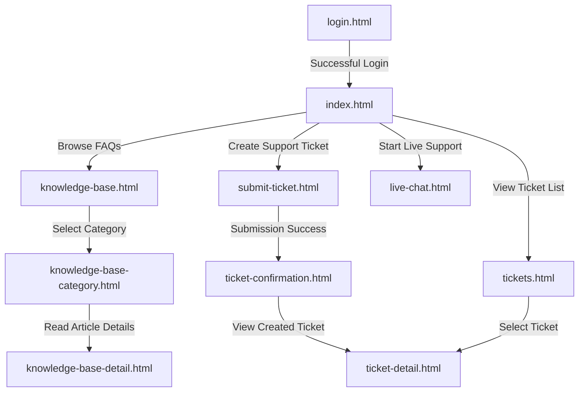

# Game Support Customer Portal

This document describes in detail the system of pages and the operational user flow of the **Customer Support Website** for the game company. The system is designed to allow players to easily search for self-help guides or interact directly with the support team to resolve their issues.

---

## 📌 System Overview

The system is designed with a premium, clean aesthetic focused on user experience:
1. **Direct Game Auth (Authentication Required):** Players use their existing game account credentials to log in to the support portal.
2. **Knowledge Base (KB):** Provides pre-written articles categorized under main areas (Technical, Account & Security, Billing & Purchases, In-Game Content, Report a Player, and Community Support) for self-service help.
3. **Support Ticket System:** Allows players to submit personalized support tickets, track active cases, and review detailed issue breakdowns.
4. **Live Chat Support:** Real-time chat channel connecting players with support agents.

---

## 🗺️ User Flow

---

## 📄 Page Descriptions

Below is a detailed description of the functions and components of the 10 HTML pages in the system:

### 1. [login.html](file:///c:/Users/ADMIN/Downloads/customer/login.html) - Login Page
*   **Purpose:** The entry point of the support portal. Authenticates users using game accounts for secure and personalized support.
*   **Key Components:**
    *   Secure form inputs for **Username** (Email) and **Password** (with visibility toggle).
    *   Red inline error message box for failed authentication warnings.
    *   Pre-filled credentials bypass helper for rapid local testing.

### 2. [index.html](file:///c:/Users/ADMIN/Downloads/customer/index.html) - Support Home Page
*   **Purpose:** The main navigation dashboard after login. Provides quick shortcuts to all available help channels.
*   **Key Components:**
    *   Dynamic greeting banner addressing the logged-in customer by name.
    *   Direct links to the 6 core help categories (Technical Issues, Account & Security, Billing & Purchases, Connection & Network, Report a Player, Bug Report) that open their respective guides.
    *   Two support options:
        *   **Submit a Ticket:** Direct link to the ticket creation form.
        *   **Start Live Chat:** Launch real-time operator chat.

### 3. [knowledge-base.html](file:///c:/Users/ADMIN/Downloads/customer/knowledge-base.html) - Knowledge Base Hub
*   **Purpose:** A catalog of self-help articles categorized by topic, allowing players to resolve bugs independently.
*   **Key Components:**
    *   Hero section search input.
    *   Main category grid (Technical, Account, Billing, In-Game, Player Report, Community).
    *   **"View all 12 categories"** button which expands the grid with 6 additional sub-categories (Downloads, Esports, Merchandise, Creators, Language, and Feedback).

### 4. [knowledge-base-category.html](file:///c:/Users/ADMIN/Downloads/customer/knowledge-base-category.html) - Category Articles List
*   **Purpose:** Lists articles belonging to a specific selected category.
*   **Key Components:**
    *   Breadcrumb navigation path.
    *   Dynamic headers reflecting the active category description.
    *   List of articles showing the title, snippet, estimated reading time, and last update date.

### 5. [knowledge-base-detail.html](file:///c:/Users/ADMIN/Downloads/customer/knowledge-base-detail.html) - Article Detail View
*   **Purpose:** Displays the full step-by-step resolution guide for a selected issue.
*   **Key Components:**
    *   Well-formatted article content featuring sections, driver requirements tables, warnings, and notice banners.
    *   Interactive article feedback widget (`"Was this article helpful?"` with Yes/No actions) displaying a thank-you message.
    *   Direct CTAs at the bottom to submit a ticket or start live chat if the guide doesn't resolve the user's issue.

### 6. [submit-ticket.html](file:///c:/Users/ADMIN/Downloads/customer/submit-ticket.html) - Submit a Support Ticket
*   **Purpose:** Allows players to submit a formal support request to database systems for agent review.
*   **Key Components:**
    *   Product (game select) and category dropdown fields.
    *   Dynamic form fields rendered automatically depending on the chosen category (e.g. Operating System, Error Code, Issue Type, platform details).
    *   Input validator that enables the submit button only when all mandatory fields and descriptions are filled.

### 7. [ticket-confirmation.html](file:///c:/Users/ADMIN/Downloads/customer/ticket-confirmation.html) - Ticket Created Successfully
*   **Purpose:** Intermediate page informing the user that their support request has been logged.
*   **Key Components:**
    *   Confirmation success checkmark showing the dynamic ticket ID.
    *   Response time expectation details.
    *   Direct links to view the newly created ticket details or return home.

### 8. [tickets.html](file:///c:/Users/ADMIN/Downloads/customer/tickets.html) - My Tickets List
*   **Purpose:** Dashboard for players to review, filter, and monitor all their submitted support requests.
*   **Key Components:**
    *   Status filter tabs: **All Tickets**, **Open**, **In Progress**, and **Resolved**.
    *   Interactive data table displaying the Ticket ID, Game, Category, Date Created, and color-coded status badges.

### 9. [ticket-detail.html](file:///c:/Users/ADMIN/Downloads/customer/ticket-detail.html) - Ticket Detail Details
*   **Purpose:** Redesigned screen matching the mockup layout displaying ticket metadata and description details.
*   **Key Components:**
    *   Header title inline with a status badge.
    *   Status banner indicating active agent investigation details.
    *   Product / Category sidebar cards.
    *   Additional information grid parsing and displaying custom system metadata values (Operating System, Issue Type, CPU/GPU, etc.) alongside the description.

### 10. [live-chat.html](file:///c:/Users/ADMIN/Downloads/customer/live-chat.html) - Live Chat Support
*   **Purpose:** Instant messaging terminal connecting the user to active support specialists.
*   **Key Components:**
    *   Real-time chat widget indicating queue wait time and agent status.
    *   Chat logs separating agent messages and customer replies.
    *   **End Chat** action to safely disconnect the session.

---

## 🛠️ Technology Stack
*   **HTML5 & Tailwind CSS:** Responsive layouts optimized for both desktop and mobile screens.
*   **Supabase Client:** Authenticates and fetches active data (games list, ticket status updates, category guides, user profiles) directly from real-time tables.
*   **Material Symbols Outlined & Google Fonts (Inter):** Premium typography and iconography.
*   **Interactive Preview Script:** Script bindings simulating page-to-page navigation for local prototype testing.
